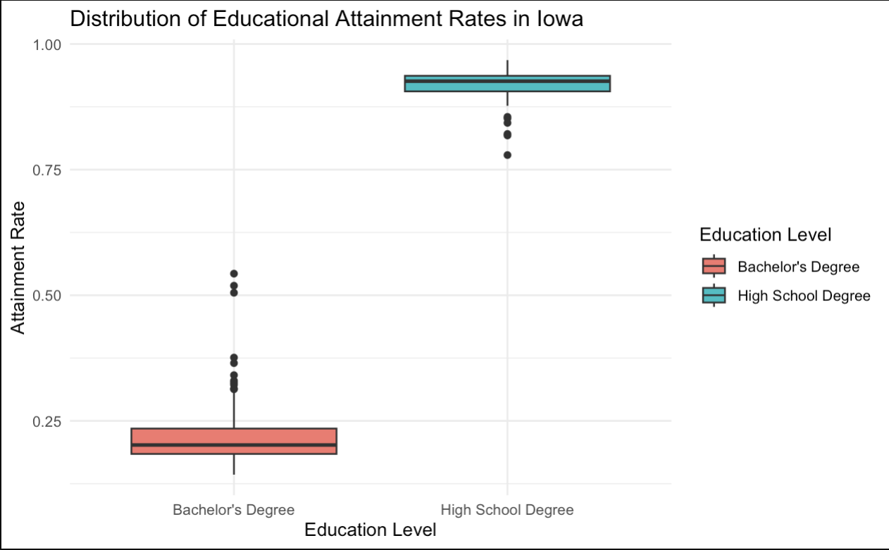
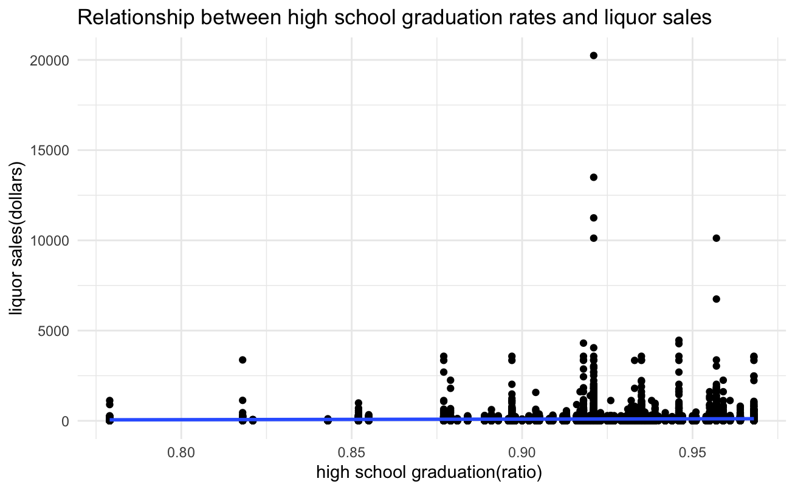
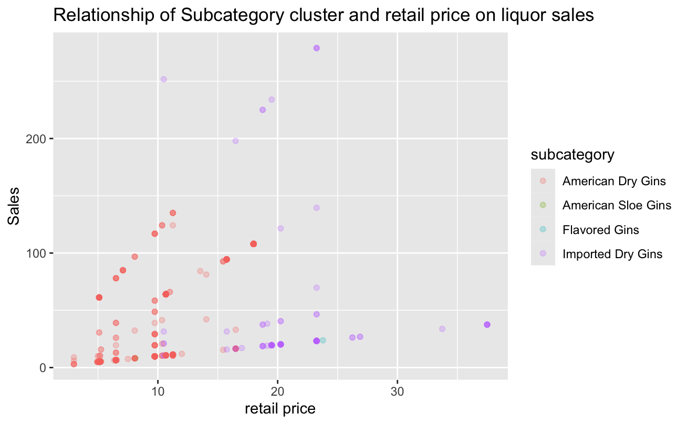

# Final Report

*Research Question: Our research question is: Are there any notable patterns in liquor sales based on educational attainment levels within Iowa communities? By addressing this question, we hope to answer if areas with higher levels of education exhibit different purchasing behaviors compared to areas with lower educational attainment*

# Introduction

This project aims to aid the Director of the Iowa Public Health Department of Iowa in their public health advertisement campaign aimed at reducing excessive alcohol consumption. Our analyses will be helpful in better understanding ***ifsthere is any underlying relationship between education attainment levels (high school degree and bachelor degree) and liquor sales in the state of Iowa***? If analyses supports that there is a significant relationship between education attainment levels and liquor sales, this information can be used to help decide which counties need targeted campaigns and resource allocation most immediately based on region-level education attainment level data. We will also investigate how and if other factors impact liquor sale trends (i.e. time, socioeconomic factors, demographic factors) and offer this information to the Director of Public Health so that they are aware of other relevant factors linked to liquor sales in the state of Iowa. This information will be valuable to the Director of the Public Health Department as they attempt to target specific regions that may be in need targeted campaigns and resource allocation with the hopes of combating excessive alcohol consumption. Targeted anti-excessive drinking campaigns and resource allocations in "at-risk" regions could improve the health and safety of Iowa residents.

# Data Summary

A few main data sources were considered throughout data analysis:

The first data source analyzed is a merged data source of liquor sales in various regions of Iowa and education attainment levels in different regions of Iowa. This data source was created by combining Iowa's demographic and economic data made available through the American Community Survey (ACS) with data related to liquor sales in the state of Iowa from BLANK to BLANK. The ACS has data regarding the percent of the population (per county) that has a high school degree or higher as well as the percent of the population (for each county) that have a bachelors degree or higher. The segmentation of the ACS dataset based on different educational attainment levels allows for comparisons to be made for liquor sale patterns across counties with varying levels of educational attainment.

The second data source analyzed ([Gin_LiquorSales_Education.csv](https://github.com/yeshimonipede/Iowa_LiquorSales_Education/blob/main/data/Gin_LiquorSales_Education.csv "Gin_LiquorSales_Education.csv")) is a merged data source of gin sales in Iowa in the years 2016 and 2017. This data source has region by region gin sales information in the form of sales in dollars, sales in volume, and sales in volume. Access to multiple metrics of sales allows us to support any trends that we see with multiple forms of sales. Considering liquor sales in volume ensures that our analyses are considering the amount of liquor purchased rather than just the total amount of money spent purchasing liquor sales which is our focus since our intended audience is concerned with alcohol consumption rather than solely the amount of money spent on liquor. Another asset of this dataset is that it can be broken down temporally. There is information related to liquor sales broken down into months, which allows us to consider how liquor sales have progressed over time and identify and time-related trends.

Based on the second data source we used, it would be more helpful to extract part of columns in the data to do the analysis, so by extracting columns of liquor sales, county and edcuational attainment level related (high school graduation and bachelor dergee rates) to find more detailed relationship between the gin liquor sales and educated levels for different counties.

## Brief Data Summary

Education attainment levels are the main variable that we are analyzing in relation to liquor sales in the state of Iowa.

These are the 10 counties with the **lowest** high school degree attainment rates:

| County      | High School Degree Attainment Rate |
|:------------|:-----------------------------------|
| Buena Vista | 0.779                              |
| Crawford    | 0.818                              |
| Davis       | 0.821                              |
| Louisa      | 0.843                              |
| Marshall    | 0.852                              |
| Clarke      | 0.855                              |
| Woodbury    | 0.877                              |
| Wapello     | 0.879                              |
| Osceola     | 0.881                              |
| Allamakee   | 0.884                              |

These are the 10 counties with the **lowest** Bachelor's Degree attainment rates:

| County     | Bachelor's Degree Attainment Rate |
|------------|-----------------------------------|
| Wayne      | 0.143                             |
| Taylor     | 0.148                             |
| Osceola    | 0.150                             |
| Crawford   | 0.151                             |
| Tama       | 0.156                             |
| Monona     | 0.157                             |
| Clarke     | 0.159                             |
| Pocahontas | 0.159                             |
| Wright     | 0.163                             |
| Van Buren  | 0.164                             |

Figure xxx demonstrates the distribution of the education attainment levels across counties in the state of Iowa.

```         
```

Figure xx

|                    | Minimum |   Q1   | Median |  Mean  |   Q3   |  Max   |  IQR   |
|--------------------|:-------:|:------:|:------:|:------:|:------:|:------:|:------:|
| High School Degree | 0.7790  | 0.9058 | 0.9260 | 0.9193 | 0.9367 | 0.9680 | 0.0309 |
| Bachelor's Degree  | 0.1430  | 0.1842 | 0.2020 | 0.2255 | 0.2347 | 0.5430 | 0.0505 |

Figure xx provides a basic statistical summary of education attainment level across counties in the state of Iowa:

From this summary, we can conclude that, on average, counties in Iowa have higher rates of high school graduates compared to residents with bachelor's degrees.

The small IQRs for both education attainment levels suggests that the middle 50% of counties have similar education attainment levels. However, the max value for the Bachelor's Degree data suggests that there may be some counties that have notably higher bachelor's degree attainment levels. This is supported by figure xx as there are clearly some high outliers in the bachelor's degree box and whisker plot.

# Data Analytics

## Investigating the Relationship between Time and Liquor Sales 

Linear regression analyses were performed on the data set that considered gin sales in Iowa from 2016-2017. The intention of the analysis was to establish whether or not there is a statistically significant relationship between liquor sales (in both dollars and volume) in Iowa and time. It was established that there is indeed a significant relationship between liquor sales and time and that liquor sales are decreasing as time increases.

A linear regression analysis revealed that there is a significant relationship between liquor sales in dollars and time. The model was able to fit a decreasing straight line between monthly gin sales (in dollars) across the last two years. The linear model suggests that on average, there is a \$268.80 decrease in gin sales in the state of Iowa. The date coefficient has a p-value of 0.0319, which is less than 0.05, thus signifying a statistically significant relationship between time and gin sales. The R-squared value is 0.1927, which suggests that approximately 19% of the variance in total sales (in dollars) is explained by time. This suggests that liquor sales (in dollars) is somewhat dependent on the variable of time.

### Linear Regression Model examining the relationship between time and gin sales (in dollars)


### Linear Regression Model examining the relationship between time and gin sales (in volume)


A linear regression analysis revealed that there is a significant relationship between liquor sales in volume and time. The model was able to fit a decreasing straight line between monthly gin sales in Iowa (in volume) across the last two years. The linear model suggests that on average, there is a 61.73 volume unit monthly decrease in gin sales in the state of Iowa. The date coefficient has a p-value of 2.89e-05, which is much less than 0.05, thus signifying a statistically significant relationship between time and gin sales. The R-squared value is 0.556, which suggests that approximately 56% of the variance in total sales (in volume) is explained by time. This suggests that liquor sales (in dollars) is moderately dependent on the variable of time.

There are a few assumptions underlying linear regression analysis such as linearity, independence of observations, constant variance and normality of residuals. Many of these assumptions can be assessed with a histogram of the residuals and a Quantile-Quantile plot. The bell shapted histogram of the residuals and the Q-Q plot both suggest that these models meet these assumptions. The points on the Q-Q plot form a straight, diagonal line as they should. The fulfillment of these assumptions strengthens the reliability of these linear regression models and adds validity to our conclusion that time and liquor sales exhibit a statistically significant relationship.

   

Both linear regression models suggest that historically liquor sales have decreased as a result of time progressing. This statistical significance of these models suggest that sales measured in both dollars and volume will continue to decrease as time increases. This information may be useful for the policy maker for multiple reasons. This information is valuable as it confirms that historically time does have an impact on liquor sales. The director of public health should be made aware of as many factors as possible that influence liquor sales in order to best make a plan to decrease liquor consumption. Another reason this information is valuable as it suggests that any resource allocation or targeted campaigning that the department of public health has applied from 2016 to 2017 was potentially helpful as gin sales did decrease in this time span. This may encourage the policy maker to continue certain efforts (i.e. continue targeting the specific regions that have been targeted during this time or continue a certain kind of resource allocation) that have already been applied in hopes of continuing to decrease liquor sales in Iowa.

## Investigating the relationship between education attainment levels and liquor sales 

### Linear Regression Model testing the high school graduation and bachelor degree on the liquor sales dollars

By examining county-level data including liquor sales dollars, high school graduation rates, and bachelor's degree rates, how different levels of educational attainment influence liquor sales was able to be assessed. The linear regression analysis indicates that both high school graduation and bachelor's degree rates have a positive effect on liquor sales. It was determined that across all counties, a 1-unit increase in high school graduation rates results in an average increase of \$319.20 of all liquor sales. Furthermore, the linear regression analyses suggests that a 1-unit increase in bachelor's degree rates is associated with an average increase of \$509.20 of total liquor sales across Iowa.

The figure xxx illustrates the relationship between bachelor's degree rates and liquor sales. As bachelor's degrees increase horizontally, the plot shows that liquor sales increase as well. This indicates a positive correlation between the percentage of people with bachelor's degrees in a county and the total liquor sales.


Figure xxx visualizes the relationship between high school degree attainment rates and liquor sales across Iowa. There is again a strong positive visual relationship present. As the attainment of high school graduation rates increases, so does the total liquor sales in dollars. 

Comparing the two graphs, we can analyze the characteristics of high school graduation and bachelor's degrees. The distribution of high school graduation percentages is skewed to the left, indicating that most people in all counties in Iowa have a graduation rate of over 90-95%. This is reflected in the clustering of data points around the 0.90-0.95 range. On the other hand, the distribution of bachelor's degrees is skewed to the right, suggesting that most people in these counties do not have bachelor's degrees. The number of data points sharply decreases when the bachelor's degree rate exceeds 0.3, while at the same time, there is an increase in the cumulative liquor sales.

Regression analysis of high school graduation and bachelor's degree data helps uncover the relationship between liquor consumption and counties, differentiated by educational level. Defining specific thresholds for educational levels, such as lower high school graduation rates and higher bachelor's degree rates within a county, can provide valuable insights for policymakers in designing tactics to address liquor consumption issues.

## Using Welch Two-Sample t-Tests to Analyze County Educational Levels and Their Impact on Liquor Sales

Conducting Welch two-sample t-tests on defined proportions with high or low levels of education allows for the analysis of the average educational level of a specific county and its correlation with liquor sales. This approach can help policymakers identify counties with particular educational profiles and examine their corresponding liquor sales numbers. By understanding how educational attainment relates to liquor sales, the director of public health can target interventions and educational campaigns more effectively.

By setting a threshold of 0.9 for high school graduation rates, counties are separated into two groups: those with high school graduation rates of 0.9 or higher and those with rates lower than 0.9. This creates the basis for a two-sample t-test. The two-sample t-test is used to examine whether there is a significant difference in the proportions of high school graduation or bachelor's degrees between two groups of counties. The resulting p-value is smaller than the chosen significance level of p\<0.05. Therefore, we reject the null hypothesis that there is a significant difference in the proportion of high school graduation between the two groups. The significant p-value suggests that this difference is not due to chance.

 The process was similar for separating counties based on higher and lower bachelor's degree rates, with a threshold set at 0.2. The resulting p-value was still smaller than the chosen significance level, indicating a significant difference in the proportion of bachelor's degrees between the higher and lower bachelor degree groups. There are only 51 counties with bachelor's degree rates higher than 0.2.

{alt="higher_bachelor_liquor"}

Plotting the relationship between liquor sales and the distribution of bachelor's degrees among these 51 counties can help narrow the analysis. The plot reveals a clear trend: as educational attainment rises, alcohol consumption decreases, eventually approaching zero. This suggests that counties with higher levels of education tend to have lower liquor sales. This is valuable information for the Director of Public Health as it means they should consider targeting counties with lower bachelor degree attainment rates since there is a trend present in the data.

To provide a more comprehensive analysis, we can compare the relationship between lower high school graduation rates and liquor consumption as an opposite scenario. Only 19 counties have high school graduation rates lower than 0.9. It is important to note the two points on the left that demonstrate the highest liquor sales. These two counties demonstrate the highest liquor sales of the 19 "lower high school graduation rate" group. While only a small sliver of data is displayed in this plot, it suggests that generally, liquor sales are lower in counties that exhibit higher high school graduation percentages, even in this plot of the 19 counties with the lowest high school graduation rate. This suggests that educational attainment is an essential estimator of liquor sales and that the Director of Public Health should consider county by county education level attainment rates when planning efforts to reduce alcohol consumption.

<figure></figure>

The plot above displays the total volume of liquor sold within each county where the volume exceeds 1,000,000 units. This figure is useful for identifying counties that generated significant revenue from liquor production. By knowing which counties have significant liquor sales volumes, the Director can target interventions more effectively. They can allocate resources for public health programs or policies tailored to areas where alcohol consumption is highest. Notably, the counties with the largest total volume of liquor sales are Polk, Scott, Linn, and Johnson. Average salaries are often greater in counties with higher levels of educational attainment which is mean they have higher capability on expenses. Higher earners might have more money available to them, which would enable them to spend more on alcohol. Consequently, counties with higher levels of educational attainment can also have higher quantities of sales of alcoholic beverages, such as polk (the cipital of the state), Scott, Linn that have more institutions. Higher rates of educational attainment may be correlated with increased urbanization and economic growth in a county. There are frequently more entertainment facilities in urban areas where alcohol is served and consumed. As a result, compared to rural areas with lower levels of education, metropolitan counties with greater levels of education may have higher quantities of liquor sales.

<figure></figure>

<figure></figure>

Based on the correlation analysis, we found that the percentage of individuals with at least a bachelor's degree had a strong relationship with the percentage of high school graduates or higher, with a correlation coefficient of 0.56. This suggests that counties with higher levels of bachelor's degree attainment tend to also have higher levels of high school graduation. The percentage of high school graduates or above and liquor sales have a relatively strong positive link, as indicated by the correlation coefficient of 0.56 between the two variables. Comprehending the relationship between educational achievement and alcohol sales can have significant consequences for public health. Increased alcohol intake may raise the chance of alcohol-related health issues as well as negative social effects. Thus, in communities with higher liquor sales volumes and higher levels of educational attainment, policymakers and public health officials may need to set aside funds for targeted interventions, such as education campaigns, alcohol abuse prevention programs, or access to addiction treatment services.

Additionally, the sale of liquor, retail price, sales for bottles, and sales volume were highly correlated with each other. The retail price and volume had a correlation coefficient of 0.4. This indicates that changes in retail price and volume tend to move together, suggesting a relationship between the price at which liquor is sold and the quantity sold. This is evidence for the decision maker that though a lot of our analyses consider sales in dollars, the trends that we are identifying are still relevant to liquor consumption and not just liquor sales in dollars. The retail price and volume of liquor sales have a 0.4 correlation coefficient, indicating a moderately positive link between the two variables. Economic factors like supply and demand dynamics may also have an impact on the relationship between liquor sales volume and retail pricing. Decreased demand may result from higher retail prices, and vice versa. Nonetheless, people may be less price sensitive and more prepared to pay higher rates for alcohol in places with higher levels of educational attainment and possibly larger disposable incomes.

Tableau link: <https://public.tableau.com/app/profile/mingdong.yang/viz/Liquorsalesandeducationanalysis/Dashboard1?publish=yes>

Through the Tableau dashboard, Tanqueray Gin has the highest total sale and retail price, as seen by the bar chart of total sale and retail price. The top three in each county's bar chart of total sales are Johnson, Linn, and Scott; this is also the exact same order as in each county's bar chart of educational success. We can conclude that counties with higher overall liquor sales also typically have higher educational achievement. The top counties with bachelor's degrees or above also likely to have high school graduates or above, as seen by the education performance bar chart. This finding is consistent with our correlation research performed in R studio earlier. A positive correlation has also been observed in a time series plot between the number of sales and bachelor's degree holders; that is, the trend of sales volume is increasing as the number of bachelor's degree holders increases.

## Other Exploratory Analyses

There were a couple of exploratory analyses conducted on the data that we cannot include in our policy recommendation with full confidence but we believe may still be valuable to the policy maker.

An attempt was made to decompose the sales data into seasonal components to assess if seasonality is a factor that should be considered as the policy maker is developing targeted anti-drinking campaigns and resource allocation. However, the data was unable to be decomposed into seasonal components suggesting that seasonality should not be a consideration for the director of public health.

A forecasting analysis was conducted. The intention of this was to use various forecasting methods to estimate future gin liquor sales in the next two years. Doing this on a county by county basis would allow for the identification of "high risk" counties that are predicted to have the greatest increase in gin liquor sales. Identification of these high risk counties may be valuable information for the decision maker as these areas are at risk of increased alcohol consumption and should potentially be considered targets for resource allocation and targeted anti-drinking campaigns.

ARIMA and seasonal naive models were considered for this purpose. We hesitate to include the results from the seasonal naive model in our formal policy recommendation as seasonal naive models are quite naive models that simply consider the liquor sales from the previous seasonal period. However, we failed to identify seasonality in the data, so we expect these estimates to be poor. According to the seasonal naive model, the counties that are predicted to have the largest increase of gin sales in the next two years are:

```         
"Woodbury"    "Winneshiek"  "Clay"        "Cerro Gordo" "Story"   
```

The same approach was followed using ARIMA models. Though ARIMA models are more complex, we hesitate to formally includue the results from these models in our formal policy recommendation as many of the forecasts of gin sales in the 24 months were identical to the month before and the month after. This fixed, linear forecast is likely due to a lack of data points as we only have 24 months of data to work with and potentially also related to a lack of seasonality in the data. However, the ARIMA models were able to identify the five counties that are deemed "high risk" as they are predicted to have the largest increase in gin sales (in volume) in the next two years. These counties are:

```         
 "Black Hawk" "Webster"  "Clinton"  "Harrison"  "Union"     
```

Though we encourage the director of public health to consider these models and be aware of future liquor sales in these specific regions, we do not feel as if our models worked well enough to include the output from these models in our official policy recommendation.

***Confused about this part?***

The policy recommendation aims to understand the influence of socioeconomic factors, specifically educational attainment levels (high school education and bachelor's degree), on liquor consumption. The goal is to investigate whether there is a relationship between "high risk" counties and different levels of educational attainment.

To achieve this, a KNN (K-Nearest Neighbors) analysis was utilized. KNN can classify data points based on their similarity to neighboring points. However, before applying KNN, methods to determine the optimal number of clusters were employed. These methods include the elbow method, silhouette method, and gap statistic method. Each method helps identify the optimal number of clusters for the dataset. However, due to limitations in the dataset and predictors, there was no consensus on the optimal combination of methods. As a result, the optimal number of clusters was chosen manually as four.


Choosing Johnson County as an example for KNN analysis, we find it exhibits the highest bachelor's degree attainmente rate among all counties at 0.543. By examining the subcategories of gin and their respective retail prices, we aim to discern any correlations between higher bachelor's degree ratios and preferences for different gin categories. Specifically, we investigate whether individuals are inclined to purchase more expensive gin variants when the bachelor's degree ratio exceeds 0.2.

If we change another county as a target to find liquor sales on retail price and gin subcategory, similar patterns were showed but it's a little bit difficult to conclude that this pattern is applicable for other counties either. The subcategory of "American dry gins" clustered and liquor sales are high for this cluster, and when the retail price increases, the points that represent clusters become blurred and liquor sales increase in a slow trend. Since we did not explore models of more counties with lower high school graduation rates/ higher high school graduation rates, the overall relationship between the liquor consumption and retail prices when educational attainment level changes could be estimated on the current analysis. In the previous seasonal naive model, the counties that were predicted to have the largest increase in gin sales in the next two years also belong to the group with " higher bachelor degree" and "higher high school gradution degree rates", which may indicate they tend to buy gins with higher unit price and keep consuming. For decision makers, they not only focus on "high risk" counties but also "potential risks" counties like "Woodbury", "Clay" or "Benton".

Based on the connection of specific gin subcategory and total liquor sales, we could make some suspection in a more general way. If the current analysis is applicable, excpet finding " high risk" counties, there could be another group of counties of " low risk" that their gin sales in volume will slowly decrease in the future or just become flat. It may ba a important indicator to design policy on other kinds of liquor by fidning out the causes behind why their liquor sales may decrease.

## Advantages and Challenges of Data Analysis in RStudio and Tableau

**Advantages**

There are some notable advantages of conducting data analysis in RStudio. One major advantage is that RStudio is really compatible with working in Github. Creating, maintaining, and formatting the README file in RStudio was quite simple since it functions practically like any other word processing software. This made it easy to embed images, add headers, and format the README report like a normal document. Another convenient aspect is that RStudio works well with reading in files from Github. RStudio adjusts the working directory to where the file that is trying to be pulled in is located. This means that anyone who clones our repo, including our data folder, can seamlessly run our analysis scripts. With Tableau, we can easily construct interactive dashboards and visualizations by dragging and dropping data fields into the canvas, all without having to write any code. This makes it perfect for exploratory analysis and quick insights. Numerous data sources can easily connect to Tableau which allowed for simultaneous data evaluation from multiple sources.

**Disadvantages**

Getting used to version control in RStudio was a bit difficult for a group of beginners. Managing version conflicts on the README file was definitely challenging and we had to redo aspects of our report that disappeared as a result of version complications. An asset of RStudio was definitely being able to use different packages and libraries. However, familiarizing yourself with the packages that you need was challenging at times. This was relevant in a group project because people used different packages for their own analyses. A difficulty when it came to working with Tableau was that the dashboard could have long load times and slow refresh rates.

# Conclusion

### Summary of analytic methodology

Linear regression analyses between gin sales (in both bottles and sales) from 2016-2017

Linear regression analyses between gin sales on bachelor degree and high school graduation ratio

two-sample t test between higher/lower educational attainment level

### Consulting the initial research questions

### Limitations

A major limitation that we ran into as we were attempting the forecasting analyses was the lack of data. We were only provided with data from 2016 to 2017 which made it difficult for us to create a working forecasting model that we trusted and could include in our policy recommendation. Access to more time series data would allow us to expand on our forecasting analyses and strengthen our policy recommendation. Another related limitation is that the time series information that we did have access to was only for gin sales rather than all liquor sales. Again, having more data, this time in the form of all liquor sales and not just gin sales could strengthen our policy recommendation as the Director of Public Health is interested in all liquor sales and not solely gin sales.

When examining liquor sales in both dollar value and volume across different levels of educational attainment, we've encountered difficulties in devising a suitable analytical approach to understand the interconnection between these variables. Determining high or low educational attainment for each county poses a challenge, as percentages vary, and manually assigning these categories may skew our interpretation of the outcomes due to the absence of relevant covariates. As such, formulating policy recommendations on liquor consumption based solely on educational attainment warrants caution, as other influential factors need consideration to provide a comprehensive analysis.

Another challenge for a project like this is seamlessly integerating analyses from different group members. While the research question drives all of our analyses, it is difficult to synthesize all of our findings into a unified policy recommendation.

### Future Work

In the future, it would be nice to expand this project to include city-related data as well. At this time the Director of Public Health is most concerned with county level data but it would be interesting to consult city level data and see how our analyses and conclusions differ.

# Policy Recommendation
