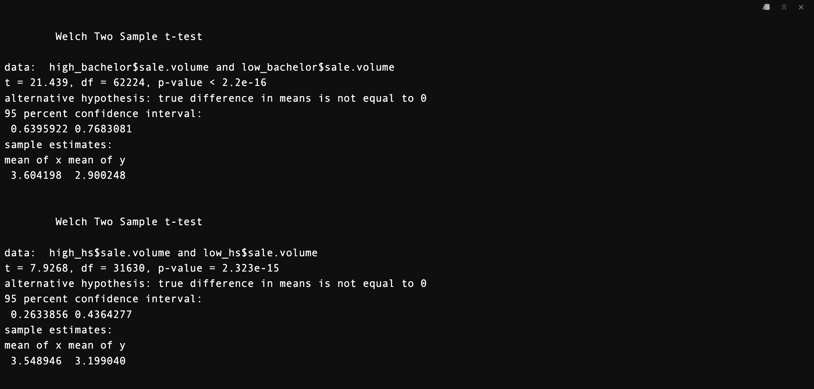
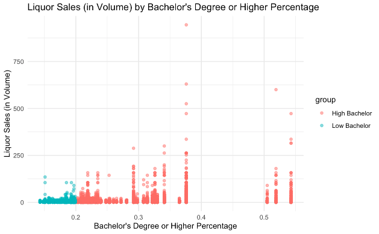
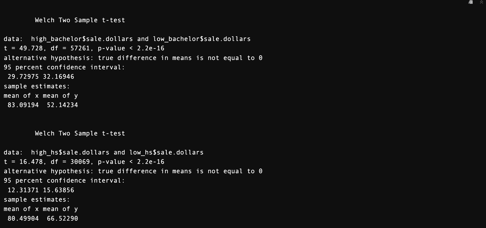

# Final Report

# Introduction

This project aims to aid the Director of the Iowa Public Health Department of Iowa in their public health advertisement campaign aimed at reducing excessive alcohol consumption. Our analyses will be helpful in better understanding ***if there is any underlying relationship between education attainment levels (high school degree and bachelor degree) and liquor sales in the state of Iowa***. If analyses supports that there is a significant relationship between education attainment levels and liquor sales, this information can be used to help decide which counties need targeted campaigns and resource allocation most immediately based on region-level education attainment level data. We will also investigate how and if other factors impact liquor sale trends (i.e. time, socioeconomic factors, demographic factors) and offer this information to the Director of Public Health so that they are aware of other relevant factors linked to liquor sales in the state of Iowa. This information will be valuable to the Director of the Public Health Department as they attempt to target specific regions that may be in need targeted campaigns and resource allocation with the hopes of combating excessive alcohol consumption. Targeted anti-excessive drinking campaigns and resource allocations in "at-risk" regions could improve the health and safety of Iowa residents.

# Data Summary

A few main data sources were considered throughout data analysis:

The first data source analyzed ([Iowa_AllLiquorSales_Education.csv](https://github.com/yeshimonipede/Iowa_LiquorSales_Education/blob/main/data/Iowa_AllLiquorSales_Education.csv "Iowa_AllLiquorSales_Education.csv")) is a merged data source of liquor sales in various regions of Iowa and education attainment levels in different regions of Iowa. This data source was created by combining Iowa's demographic and economic data made available through the American Community Survey (ACS) with data related to liquor sales in the state of Iowa. The ACS has data regarding the percent of the population (per county) that has a high school degree or higher as well as the percent of the population (for each county) that have a bachelors degree or higher. The segmentation of the ACS dataset based on different educational attainment levels allows for comparisons to be made for liquor sale patterns across counties with varying levels of educational attainment.

The second data source analyzed ([Gin_LiquorSales_Education.csv](https://github.com/yeshimonipede/Iowa_LiquorSales_Education/blob/main/data/Gin_LiquorSales_Education.csv "Gin_LiquorSales_Education.csv")) is a merged data source of gin sales in Iowa in the years 2016 and 2017. This data source has region by region gin sales information in the form of sales in dollars, sales in volume, and sales in volume. Access to multiple metrics of sales allows us to support any trends that we see with multiple forms of sales. Considering liquor sales in volume ensures that our analyses are considering the amount of liquor purchased rather than just the total amount of money spent purchasing liquor sales which is our focus since our intended audience is concerned with alcohol consumption rather than solely the amount of money spent on liquor. Another asset of this dataset is that it can be broken down temporally. There is information related to liquor sales broken down into months, which allows us to consider how liquor sales have progressed over time and identify and time-related trends.

All sub datasets were extracted from the second data source mentioned above.

## Brief Data Summary

Education attainment levels are the main variable that we are analyzing in relation to liquor sales in the state of Iowa.

These are the 10 counties with the **highest** high school degree attainment rates:

| County     | High School Degree Attainment Rate |
|:-----------|:-----------------------------------|
| Story      | 0.968                              |
| Bremer     | 0.964                              |
| Winneshiek | 0.961                              |
| Dickinson  | 0.959                              |
| Warren     | 0.959                              |
| Johnson    | 0.957                              |
| Dallas     | 0.955                              |
| Madison    | 0.955                              |
| Cedar      | 0.954                              |
| Grundy     | 0.951                              |

These are the 10 counties with the **highest** Bachelor's Degree attainment rates:

| County    | Bachelor's Degree Attainment Rate |
|-----------|-----------------------------------|
| Johnson   | 0.543                             |
| Story     | 0.519                             |
| Dallas    | 0.505                             |
| Polk      | 0.376                             |
| Jefferson | 0.365                             |
| Linn      | 0.341                             |
| Bremer    | 0.33                              |
| Scott     | 0.326                             |
| Dickinson | 0.322                             |
| Dubuque   | 0.314                             |

Figure 1 demonstrates the distribution of the education attainment levels across counties in the state of Iowa.

Figure 1

|                    | Minimum |   Q1   | Median |  Mean  |   Q3   |  Max   |  IQR   |
|--------------------|:-------:|:------:|:------:|:------:|:------:|:------:|:------:|
| High School Degree | 0.7790  | 0.9058 | 0.9260 | 0.9193 | 0.9367 | 0.9680 | 0.0309 |
| Bachelor's Degree  | 0.1430  | 0.1842 | 0.2020 | 0.2255 | 0.2347 | 0.5430 | 0.0505 |

Figure 2

Figure 2 provides a basic statistical summary of education attainment level across counties in the state of Iowa:

From this summary, we can conclude that, on average, counties in Iowa have higher rates of high school graduates compared to residents with bachelor's degrees.

The small IQRs for both education attainment levels suggests that the middle 50% of counties have similar education attainment levels. However, the max value for the Bachelor's Degree data suggests that there may be some counties that have notably higher bachelor's degree attainment levels. This is supported by figure xx as there are clearly some high outliers in the bachelor's degree box and whisker plot.

# Data Analytics

## Investigating the relationship between education attainment levels and liquor sales

## Welch Two-Sample t-Tests to Analyze County Educational Levels and Their Impact on Liquor Sales

Conducting Welch two-sample t-tests on defined proportions with high or low levels of education allows for the analysis of the average educational level of a specific county and its correlation with liquor sales. This approach can help policymakers identify counties with particular educational profiles and examine their corresponding liquor sales numbers. By understanding how educational attainment relates to liquor sales, the director of public health can target interventions and educational campaigns more effectively.

The dataset was filtered to create two groups based on educational attainment levels:

-   High Bachelor's degree group: Counties where the percentage of individuals with a Bachelor's degree or higher was greater than 20%.

-   Low Bachelor's degree group: Counties where the percentage of individuals with a Bachelor's degree or higher was less than 20%.

-   High school graduate group: Counties where the percentage of high school graduates or higher was greater than 90%.

-   Low high school graduate group: Counties where the percentage of high school graduates or higher was less than 90%.

## T-test analysis of education attainment levels and liquor sales (in volume)

Welch's Two Sample t-tests were conducted to compare liquor sales volume between the high and low groups based on educational attainment levels. For both Bachelor's degree attainment and high school graduate attainment, significant differences were found in liquor sales volume between the high and low groups.The p-values for both comparisons were highly significant (p \< 2.2e-16), indicating strong evidence against the null hypothesis of no difference in mean liquor sales volume between the groups and therefore suggests that education attainment rates has a statistically significant differences on liquor sales.

Figure 3 contains the results from the two t-tests run. One t-test was considering sales regarding bachelor degree attainment levels while the second t-test was considering sales (in volume) regarding high school degree attainment.

The first t-test indicates that counties with a higher percentage of individuals with a Bachelor's degree or higher had significantly higher mean liquor sales volume compared to counties with a lower percentage. The mean liquor sales volume for counties with a high percentage of Bachelor's degree or higher was \$83.09, while for counties with a low percentage, it was \$52.14.

Similarly, counties with a higher percentage of high school graduates or higher had significantly higher mean liquor sales volume compared to counties with a lower percentage. The mean liquor sales volume for counties with a high percentage of high school graduates or higher was \$80.50, while for counties in the low group, it was \$66.52.






Figures 3 and 4 support the findings of the t-test. With regard to both high school diploma and bachelor's degree attainment levels, counties in the "high education attainment" groups were the counties responsible for the higher liquor purchases in volume.

##  T-test analysis of education attainment levels and liquor sales (in dollars)

{width="1038"}

Using data on liquor sales and educational attainment across counties, we conducted Welch's Two Sample t-tests to compare the mean liquor sales (in dollars) between counties with high and low levels of educational attainment. Again, p-values for both bachelor's degree attainment levels and high school diploma attainment levels statistically significant.

Referring to Figure 6, counties with higher Bachelor's degree attainment levels had a significantly higher mean liquor sales volume compared to counties with lower Bachelor's degree attainment levels. The mean liquor sales in counties with high Bachelor's degree attainment were \$83.09, while in counties with low attainment, the mean sales were \$52.14. This suggests a positive association between Bachelor's degree attainment and liquor sales volume.

Similarly, counties with higher high school graduate attainment levels exhibited significantly higher mean liquor sales compared to counties with lower high school graduate attainment levels. The mean liquor sales in counties with high high school graduate attainment were \$80.50, whereas in counties with low attainment, the mean sales were \$66.52. This implies a positive correlation between high school graduate attainment and liquor sales volume.

### Linear Regression Model testing the high school graduation and bachelor degree on the liquor sales dollars

By examining county-level data including liquor sales dollars, high school graduation rates, and bachelor's degree rates, how different levels of educational attainment influence liquor sales was able to be assessed. The linear regression analysis indicates that both high school graduation and bachelor's degree rates have a positive effect on liquor sales. It was determined that across all counties, a 1-unit increase in high school graduation rates results in an average increase of \$319.20 of all liquor sales. Furthermore, the linear regression analyses suggests that a 1-unit increase in bachelor's degree rates is associated with an average increase of \$509.20 of total liquor sales across Iowa.

## Visualizing Volume Sales


Figure 7 displays the total volume of liquor sold within each county where the volume exceeds 1,000,000 units. This figure is useful for identifying counties that generated significant revenue from liquor production. By knowing which counties have significant liquor sales volumes, the Director can target interventions more effectively. They can allocate resources for public health programs or policies tailored to areas where alcohol consumption is highest. Notably, the counties with the largest total volume of liquor sales are Polk, Scott, Linn, and Johnson. Polk, Scott, and Johson are all amongst the top ten counties with the highest high school degree attainment proportions.


Based on the correlation analysis in Figure 8, we found positive associations between increasing high school degree attainment rates and sales in volume and dollars. There is also positive correlation between bachelor degree attainment rates and liqour sales in the form of bottles, volume, and dollars.

We also found that the percentage of individuals with at least a bachelor's degree had a strong relationship with the percentage of high school graduates or higher, with a correlation coefficient of 0.56. This suggests that counties with higher levels of bachelor's degree attainment tend to also have higher levels of high school graduation.

## Investigating the Relationship between Time and Liquor Sales

Linear regression analyses were performed on the data set that considered gin sales in Iowa from 2016-2017. The intention of the analysis was to establish whether or not there is a statistically significant relationship between liquor sales (in both dollars and volume) in Iowa and time. It was established that there is indeed a significant relationship between liquor sales and time and that liquor sales are decreasing as time increases.

A linear regression analysis revealed that there is a significant relationship between liquor sales in dollars and time (Figure 9). The model was able to fit a decreasing straight line between monthly gin sales (in dollars) across the last two years. The linear model suggests that on average, there is a \$268.80 decrease in gin sales in the state of Iowa. The date coefficient has a p-value of 0.0319, which is less than 0.05, thus signifying a statistically significant relationship between time and gin sales. The R-squared value is 0.1927, which suggests that approximately 19% of the variance in total sales (in dollars) is explained by time. This suggests that liquor sales (in dollars) is somewhat dependent on the variable of time.

### Linear Regression Model examining the relationship between time and gin sales (in dollars)


### Linear Regression Model examining the relationship between time and gin sales (in volume)

{alt="Figure x, Linear Regression (Sales in Volume)"}

A linear regression analysis revealed that there is a significant relationship between liquor sales in volume and time (Figure 10). The model was able to fit a decreasing straight line between monthly gin sales in Iowa (in volume) across the last two years. The linear model suggests that on average, there is a 61.73 volume unit monthly decrease in gin sales in the state of Iowa. The date coefficient has a p-value of 2.89e-05, which is much less than 0.05, thus signifying a statistically significant relationship between time and gin sales. The R-squared value is 0.556, which suggests that approximately 56% of the variance in total sales (in volume) is explained by time. This suggests that liquor sales (in volume) is moderately dependent on the variable of time.

There are a few assumptions underlying linear regression analysis such as linearity, independence of observations, constant variance and normality of residuals. Many of these assumptions can be assessed with a histogram of the residuals and a Quantile-Quantile plot. The bell shaped histograms of the residuals (Figure 11 and 12) and the Q-Q plot (Figure 13 and 14) both suggest that these models meet these assumptions. The points on the Q-Q plot form a straight, diagonal line as they should. The fulfillment of these assumptions strengthens the reliability of these linear regression models and adds validity to our conclusion that time and liquor sales exhibit a statistically significant relationship.

{alt="Residual Histogram Dollars"}

Figure 11

{alt="Residual Histogram Vol"}

{alt="Q-Q Plot Linear Regression"}

Figure 13

{alt="Q-Q Plot Vol"}

Both linear regression models suggest that historically liquor sales have decreased as a result of time progressing. This statistical significance of these models suggest that sales measured in both dollars and volume will continue to decrease as time increases. This information may be useful for the policy maker for multiple reasons. This information is valuable as it confirms that historically time does have an impact on liquor sales. The director of public health should be made aware of as many factors as possible that influence liquor sales in order to best make a plan to decrease liquor consumption. Another reason this information is valuable as it suggests that any resource allocation or targeted campaigning that the department of public health has applied from 2016 to 2017 was potentially helpful as gin sales did decrease in this time span. This may encourage the policy maker to continue certain efforts (i.e. continue targeting the specific regions that have been targeted during this time or continue a certain kind of resource allocation) that have already been applied in hopes of continuing to decrease liquor sales in Iowa.

## Tableau Dashboard

Tableau link: <https://public.tableau.com/app/profile/mingdong.yang/viz/Liquorsalesandeducationanalysis/Dashboard1?publish=yes>

## Other Exploratory Analyses

There were a couple of exploratory analyses conducted on the data that we cannot include in our policy recommendation with full confidence but we believe may still be valuable to the policy maker.

An attempt was made to decompose the sales data into seasonal components to assess if seasonality is a factor that should be considered as the policy maker is developing targeted anti-drinking campaigns and resource allocation. However, the data was unable to be decomposed into seasonal components suggesting that seasonality should not be a consideration for the director of public health.

A forecasting analysis was conducted. The intention of this was to use various forecasting methods to estimate future gin liquor sales in the next two years. Doing this on a county by county basis would allow for the identification of "high risk" counties that are predicted to have the greatest increase in gin liquor sales. Identification of these high risk counties may be valuable information for the decision maker as these areas are at risk of increased alcohol consumption and should potentially be considered targets for resource allocation and targeted anti-drinking campaigns.

ARIMA and seasonal naive models were considered for this purpose. We hesitate to include the results from the seasonal naive model in our formal policy recommendation as seasonal naive models are quite naive models that simply consider the liquor sales from the previous seasonal period. However, we failed to identify seasonality in the data, so we expect these estimates to be poor. According to the seasonal naive model, the counties that are predicted to have the largest increase of gin sales in the next two years are:

```         
"Woodbury"    "Winneshiek"  "Clay"        "Cerro Gordo" "Story"   
```

The same approach was followed using ARIMA models. Though ARIMA models are more complex, we hesitate to formally include the results from these models in our formal policy recommendation as many of the forecasts of gin sales in the 24 months were identical to the month before and the month after. This fixed, linear forecast is likely due to a lack of data points as we only have 24 months of data to work with and potentially also related to a lack of seasonality in the data. However, the ARIMA models were able to identify the five counties that are deemed "high risk" as they are predicted to have the largest increase in gin sales (in volume) in the next two years. These counties are:

```         
 "Black Hawk" "Webster"  "Clinton"  "Harrison"  "Union"     
```

Though we encourage the director of public health to consider these models and be aware of future liquor sales in these specific regions, we do not feel as if our models worked well enough to include the output from these models in our official policy recommendation.

***Confused about this part?***

The policy recommendation aims to understand the influence of socioeconomic factors, specifically educational attainment levels (high school education and bachelor's degree), on liquor consumption. The goal is to investigate whether there is a relationship between "high risk" counties and different levels of educational attainment.

To achieve this, a KNN (K-Nearest Neighbors) analysis was utilized. KNN can classify data points based on their similarity to neighboring points. However, before applying KNN, methods to determine the optimal number of clusters were employed. These methods include the elbow method, silhouette method, and gap statistic method. Each method helps identify the optimal number of clusters for the dataset. However, due to limitations in the dataset and predictors, there was no consensus on the optimal combination of methods. As a result, the optimal number of clusters was chosen manually as four.

[](Figure 13)

Choosing Johnson County as an example for KNN analysis (Figure 13), we find it exhibits the highest bachelor's degree attainment rate among all counties at 0.543. By examining the subcategories of gin and their respective retail prices, we aim to discern any correlations between higher bachelor's degree ratios and preferences for different gin categories. Specifically, we investigate whether individuals are inclined to purchase more expensive gin variants when the bachelor's degree ratio exceeds 0.2.

Figure 14

If we shift our focus to another county as a target for examining liquor sales based on retail price and gin subcategory, we observe similar patterns. However, it becomes challenging to generalize these patterns to other counties without further exploration. Notably, the "American dry gins" subcategory clustered distinctly, indicating high liquor sales within this cluster. Moreover, as retail prices increase, the distinction between clusters becomes less clear, suggesting a gradual increase in liquor sales.

While our analysis provides insights into the relationship between liquor consumption and retail prices under varying educational attainment levels, it's important to note that we have not explored models for a broader range of counties with different educational attainment rates. Thus, the overall relationship between liquor consumption and retail prices when educational attainment levels change remains an estimation based on our current analysis.

Furthermore, our analysis reveals a connection between specific gin subcategories and total liquor sales. This leads us to speculate more broadly. If our current analysis holds true, we may identify a group of "low-risk" counties where gin sales in volume are expected to gradually decrease or remain stagnant in the future. Understanding the underlying reasons for this trend could serve as a crucial indicator for policymakers to design policies for other types of liquor, anticipating potential decreases in sales.

In summary, while our analysis sheds light on the relationship between liquor sales, retail prices, and educational attainment levels, further investigation is necessary to validate these findings and generalize them to a wider range of counties.

## Advantages and Challenges of Data Analysis in RStudio and Tableau

**Advantages**

There are some notable advantages of conducting data analysis in RStudio. One major advantage is that RStudio is really compatible with working in Github. Creating, maintaining, and formatting the README file in RStudio was quite simple since it functions practically like any other word processing software. This made it easy to embed images, add headers, and format the README report like a normal document. Another convenient aspect is that RStudio works well with reading in files from Github. RStudio adjusts the working directory to where the file that is trying to be pulled in is located. This means that anyone who clones our repo, including our data folder, can seamlessly run our analysis scripts. With Tableau, we can easily construct interactive dashboards and visualizations by dragging and dropping data fields into the canvas, all without having to write any code. This makes it perfect for exploratory analysis and quick insights. Numerous data sources can easily connect to Tableau which allowed for simultaneous data evaluation from multiple sources.

**Disadvantages**

Getting used to version control in RStudio was a bit difficult for a group of beginners. Managing version conflicts on the README file was definitely challenging and we had to redo aspects of our report that disappeared as a result of version complications. An asset of RStudio was definitely being able to use different packages and libraries. However, familiarizing yourself with the packages that you need was challenging at times. This was relevant in a group project because people used different packages for their own analyses. A difficulty when it came to working with Tableau was that the dashboard could have long load times and slow refresh rates.

# Conclusion

### Summary of analytic methodology

1.  **T-Test Analysis:**

    -   Significantly higher mean liquor sales volume and dollars were found in counties with higher educational attainment levels (both bachelor's degree and high school graduation).

    -   P-values for both comparisons were highly significant (p \< 2.2e-16), indicating strong evidence against the null hypothesis.

2.  **Linear Regression Model:**

    -   A positive association was observed between both high school graduation rates and bachelor's degree rates with liquor sales volume and dollars.

    -   Counties with higher educational attainment levels exhibited higher liquor sales volume and dollars.

3.  **Visualizations:**

    -   Scatter plots, bar plots, and regression plots were created to visualize the relationship between educational attainment levels and liquor sales.

    -   Figures revealed a positive correlation between education attainment and liquor sales.

4.  **Relationship between Time and Liquor Sales:**

    -   Linear regression analyses indicated a significant relationship between liquor sales (in both volume and dollars) and time.

    -   Historical data showed that liquor sales decreased as time progressed, suggesting a potential impact of time on liquor consumption.

    In conclusion, these analyses provided support for our conclusion that yes, there is a statistically significant underlying relationship between education attainment levels and liquor sales in Iowa. The linear regression analyses between liquor sales and educational attainment levels revealed positive correlations between liquor sales and both high school graduation rates and bachelor's degree rates. This suggests that counties with higher levels of educational attainment tend to exhibit higher liquor sales.

    The linear regression analyses conducted between gin sales and time revealed a significant negative relationship, indicating a decrease in sales from 2016-2017 as a result of time. This suggests that time is a relative factor regarding liquor sales.

### Limitations

A major limitation that we ran into as we were attempting the forecasting analyses was the lack of data. We were only provided with data from 2016 to 2017 which made it difficult for us to create a working forecasting model that we trusted and could include in our policy recommendation. Access to more time series data would allow us to expand on our forecasting analyses and strengthen our policy recommendation. Another related limitation is that the time series information that we did have access to was only for gin sales rather than all liquor sales. Again, having more data, this time in the form of all liquor sales and not just gin sales could strengthen our policy recommendation as the Director of Public Health is interested in all liquor sales and not solely gin sales.

When examining liquor sales in both dollar value and volume across different levels of educational attainment, we've encountered difficulties in devising a suitable analytic approach to understand the interconnection between these variables. Determining high or low educational attainment for each county poses a challenge, as percentages vary, and manually assigning these categories may skew our interpretation of the outcomes due to the absence of relevant covariates. As such, formulating policy recommendations on liquor consumption based solely on educational attainment warrants caution, as other influential factors need consideration to provide a comprehensive analysis.

Another challenge for a project like this is seamlessly integrating analyses from different group members. While the research question drives all of our analyses, it is difficult to synthesize all of our findings into a unified policy recommendation.

### Future Work

In the future, it would be nice to expand this project to include city-related data as well. At this time the Director of Public Health is most concerned with county level data but it would be interesting to consult city level data and see how our analyses and conclusions differ.

Another interesting expansion would involve considering other socioeconomic factors that differ region to region. By doing so we could investigate if factors like race, income level, employment status, etc. also related to liquor sales. This information would be valuable to the Director of Public Health as they continue to aim to decrease liquor sales with the hopes of combating excessive alcohol consumption in Iowa.

# Policy Recommendation

Our official recommendation for the Director of Public Health as they aim to launch targeted anti-drinking campaigns and resource allocation with the hopes of decreasing liquor sales in the state of Iowa and furthermore reducing excessive drinking and the negative health implications that go along with alcohol abuse is to target counties that exhibit high educational attainment rates (at both the high school degree and bachelor's degree level). We deem the following counties to be considered "medium to high risk" and therefore solid targets for anti-drinking resource allocation and targeted campaigns. as the data revealed that there is positive correlation between bachelor's degree attainment rates and liquor sales in the state of Iowa. These are the counties with the highest bachelor degree attainment rates:

|            |
|:-----------|
| Story      |
| Bremer     |
| Winneshiek |
| Dickinson  |
| Warren     |
| Johnson    |
| Dallas     |
| Madison    |
| Cedar      |
| Grundy     |

Furthermore, we list the following counties as "high risk" counties as these counties have the highest high school degree attainment rate. This is because the data suggests that there is an even stronger relationship between alcohol sales and high school attainment rates (as demonstrated by the t-test results, linear regression model results, and correlation analysis). These counties should be considered as the priority in terms of resource allocation and targeted anti-drinking campaigns.

|           |
|-----------|
| Johnson   |
| Story     |
| Dallas    |
| Polk      |
| Jefferson |
| Linn      |
| Bremer    |
| Scott     |
| Dickinson |
| Dubuque   |

It is worth mentioning that Winneshiek and Story are the counties that are both on the targeted lists above and were suggested by the forecasting models as being within the top 10 counties with the biggest foretasted increase in liquor sales. We recommend keeping this information in mind as the Department of Public Health selects counties to target.

Story is the county that appears on both targeted lists and it has the highest bachelor's degree attainment rate of all of the counties and the second highest high school degree attainment rate. Story also purchased the sixth most liquor (in volume) of all counties. As a result of this data driven evidence, we strongly recommend targeting Story first and most seriously in targeted campaigns and resource allocation.

Another variable that we want to factor into our recommendation is time. As backed by data, as time has passed, liquor sales have decreased. We urge the Director of Public Health to consider the interventions and anti-drinking effors implemented from 2016-2017 and continue those as it is very likely that they are related to time's role in the decrease in liquor sales.

The first order effects of implementing our recommendation in Story as well as the other regions as well as reflecting on and continuing efforts made between 2016 and 2017 include increased awareness about the risks associated with excessive alcohol consumption in this county, resource allocation in hopes of maximizing the impact of public health efforts, and targeted campaigns that may result in stricter regulations related to liquor sales and marketing.

The second order effects we hope this plan achieves is improved general public health as people purchase and indulge in smaller quantities of liquor. This will hopefully reduce the number of injuries and deaths related to over indulgence in alcohol. Another possible second order effects is possible social well-being including lower rates of crime and violence that occur due to excessive drinking.

The risks associated with this recommendation include that education attainment levels are only one of many, many socioeconomic factors that likely influence the data. Relying on this recommendation alone runs the risk of failing to consider other factors that are potentially correlated even more strongly than education attainment levels. Our recommendation also requires a variety of resources and money in order to implement. Finally, a risk of our recommendation is resistance from liquor retailers and manufacturers who may oppose stricter regulation and an anti-alcohol agenda.
