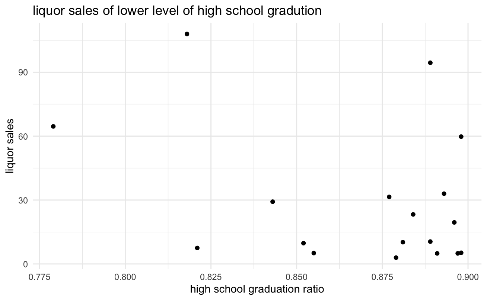

# Iowa_LiquorSales_Education

*Research Question: Our research question is: Are there any notable patterns in liquor sales based on educational attainment levels within Iowa communities? By addressing this question, we hope to answer if areas with higher levels of education exhibit different purchasing behaviors compared to areas with lower educational attainment*

*Decision Maker and decision to be made: Our decision maker will be the Director of a Public Health Department. They will be tasked with allocating resources for alcohol awareness campaigns aimed at reducing excessive alcohol consumption and related harms within Iowa communities. The goal is to target resources effectively to areas where alcohol consumption patterns suggest a need for intervention.*

*By analyzing liquor sales data, the Director can gain insights into consumption patterns across different communities. While the dataset may not directly provide information on educational attainment levels, it can still offer valuable insights into consumption trends that may correlate with socio-economic factors such as in our case, education attainment levels.*

*For example, if the analysis reveals that certain communities have significantly higher per capita liquor sales compared to others, indicating potentially higher levels of alcohol consumption, the Director may prioritize allocating resources for alcohol awareness campaigns in those areas. This targeted approach can help address the specific needs of communities with higher rates of alcohol-related issues, such as alcohol-related accidents, health problems, and social consequences.*

*By leveraging liquor sales data to inform resource allocation decisions, the Director can implement more effective alcohol awareness campaigns tailored to the needs of different communities.*

*Data Source: We will use a combination of the data on sales of liquors in Iowa (from class) with Iowa's demographic and economic data available through American Community Survey. The ACS has data regarding the percent of the population (per county) that has a high school degree or higher as well as the percent of the population (for each county) that have a bachelors degree or higher. The segmentation of the ACS dataset based on different educational attainment levels will allow for us to segment and compare liquor sale patterns across counties with varying levels of educational attainment. The liquor sales dataset will provide us with geographical and temporal information which will allow us to consider liquor sales across individual counties within Iowa on a temporal scales as it has liquor sales over time. The dataset will also allow us to look at liquor sales in three different ways: revenue in dollars, volume, and bottles which will be helpful to assess liquor sales in three different ways.*

*Tools and Methods used to Perform the Analysis: We will definitely use RStudio to perform data manipulation and data analysis. We will likely use Tableau to construct informative graphics and visualizations about liqour sales in different geographical regions. We will use descritpive summary statistics to summarize key variables, including liquor sales volume, revenue, and demographic characteristics. We will use correlation analysis to examine the relationship between educational attainment levels (high school degree or higher, bachelor's degree or higher) and liquor sales patterns. We also may run a regression analysis to model the relationship between educational attainment levels and liquor sales while controlling for potential confounding variables (e.g., demographic factors, economic indicators). Finally, we could consider using forecasting methods to predict where liquor sales may be increasing more drastically. Forecasting could potentially help the Public Health Department target which areas to allocate resources to most immediately.*

*FINAL REPORT*

*Introduction: This project aims to aid the Director of the Public Health Department of Iowa in their public health advertisement campaign aimed at reducing excessive alcohol consumption. Our analyses will be helpful in better understanding if there is any underlying relationship between education attainment levels (high school degree and bachelor degree) and liquor sales in the state of Iowa. If analyses supports that there is a significant relationship between education attainment levels and liquor sales, this information can be used to help deicide which counties need targeted campaigns most immediately. We will also investigate how and if other factors impact liquor sale trends (i.e. time) and offer this information to the Director of Public Health so that they are aware of all factors linked to liquor sales and furthermore liquor consumption, and can effectively allocate appropriate resources to certain regions to best combat excessive alcohol consumption in the state of Iowa.*

*We will use a variety of methods to investigate the relationship, if any, between liquor sales and education attainment levels in the state of Iowa on a county level basis. Graphics will help highlight how liquor sales and educational attainment levels differ from county to county. This will be valuable information to the director to be immediately and easily aware about the counties that are purchasing the most liquor as well as the distribution of education attainment levels around the state. A regression analysis will help highlighti if there is a statistically significant relationship between education attainment levels and alcohol consuption levels as well as liquor sales and times. This will help the director determine if it is of worth to target certain areas based on their educational attainment when allocating advertisement resources. K-means clustering will also help hypothesis testing by investigating if there are statistically significant differences between counties in liquor sales. Finally, forecasting analyses will use gin sales in the last few years to help determine which counties are forecasted to have the largest increase in liquor sales over the next eight quarters. This information will be valuable to the director as they can target these specific counties for prioritized resource allocation.*

*Visualizations: We will create plots in R studio and Tableau to explore our project topic, accompnaying with the statistical analysis.Since we want to explore the educational attainmet level influences on the liquor sales, also based on different liquor categories, how these socio-economic factors influence total sales? We are moving forward to see more patterns by using statistical analysis and forecasting methods. Data summary:*

*github repository: create a github repository and adding what analysis we done. We successfully download git, open the account and create repository to record the project workflow. By looking up videos , we get to know more functions of git and statring to upload files, editing the descriptions within the group. However, linking the git and local path that we do the analysis work is a fresh task, including push and pull request, and we are on the way to be more familiarize with the git.*

*Data summary:*

*We have two main data tables when running our analyses: (1) a merged dataset between the Gin liquor sales in the state of Iowa between 2016-2017 and education levels (2) a merged dataset between all liquor sales in Iowa and socioeconomic factors (such as education attainment levels)*

*Hypothesis testing:*

*-using K-means clustering to compare differences between counties By partitioning data points into clusters based on similarity, K-means helps identify meaningful patterns and relationships within datasets. Its straightforward implementation and ability to handle large volumes of data make it a go-to method for exploratory analysis and pattern recognition across various domains. In the k-means clustering, based on the The number of clusters is set up by different counties for the nature of the dataset. In order to ensure the uniformity of the analysis, the same counties were chosen as for the regression part: johnson and benton.In deciding the number of clusters, a specific value (e.g., 3) was first tried to see the size of the tss, and after that three different methods were used to see what the OPTIMAL clusters were according to the optimal cluster to adjust the value of the previously set cluster. By choosing two different regional clusters, different trends are presented when the category of wine changes, due to the different unit on retail prices. More comparison between counties or cities would be explored by k means clustering.*

*Regression Analysis*

*-to assess if there is a statistically significant relationship between education attainment levels and liquor sales -to find out the correlation between educational attainment levels and income within different counties*

*Regression Analysis between time and liquor sales: The linear regression analyses conducted confirm that there is a significant relationship between liquor sales (in both dollars and volume) and time. The significance is supported by summary statistics of the model (such as p-value). The success of the liner regression model is supported by plotting the distribution of the residuals as well as QQ plots that suggest that the residuals of the models are normalized. This information is relevant to the decision maker as there is evidence in the data to support that general liquor sales are decreasing as time increases.Insight to the factors that are influencing liquor sales can help anticpate the decision maker in anticipating demand for alcohol and planning public health interventions accordingly. The success of the linear regression model suggests that it can be used somewhat accurately to forecast liquor sales as time continues to increase. Exploration in this file (failure of seasonal decomposition) also alert the decision maker that there is no clear seasonality in the data and therefore season should not be a consideration when choosing timing to allocate advertisement resources.*

*Conclusion (still need to consider all results) - an informed and well supported assessment about whether or not there is correlation between liquor sales and education attainment levels in Iowa and if so which areas should be prioritized for a targeted advertisement campaign intended to reduce alcohol-related issues in the state of Iowa. Forecasting techniques will also provide a suggestion for which counties should be identified and monitored as "on the rise" counties in terms of predicted future liquor sales.*

*From the regression of liquor sales on the categorical and numerical variables, it's not hard to find that some major subcategories and type of item shows siginicant difference. There are three major categories of gins and during the process of classificating the correlation, the subcategories of liquor show different impacts among counties. That is a entry point for advertisement campaign; they would know which type of liquor, which brand of liquor to control.*

# Final Report

# Introduction

This project aims to aid the Director of the Public Health Department of Iowa in their public health advertisement campaign aimed at reducing excessive alcohol consumption. Our analyses will be helpful in better understanding ***if there is any underlying relationship between education attainment levels (high school degree and bachelor degree) and liquor sales in the state of Iowa***. If analyses supports that there is a significant relationship between education attainment levels and liquor sales, this information can be used to help decide which counties need targeted campaigns and resource allocation most immediately based on region-level education attainment level data. We will also investigate how and if other factors impact liquor sale trends (i.e. time, socioeconomic factors, demographic factors) and offer this information to the Director of Public Health so that they are aware of other relevant factors linked to liquor sales in the state of Iowa. This information will be valuable to the Director of the Public Health Department as they attempt to target specific regions that may be in need targeted campaigns and resource allocation with the hopes of combating excessive alcohol consumption. Targeted anti-excessive drinking campaigns and resource allocations in "at-risk" regions could improve the health and safety of Iowa residents.

# Data Summary

Two main data sources were considered in the data analysis:

The first data source analyzed is a merged data source of liquor sales in various regions of Iowa and education attainment levels in different regions of Iowa. This data source was created by combining Iowa's demographic and economic data made available through the American Community Survey (ACS) with data related to liquor sales in the state of Iowa from BLANK to BLANK. The ACS has data regarding the percent of the population (per county) that has a high school degree or higher as well as the percent of the population (for each county) that have a bachelors degree or higher. The segmentation of the ACS dataset based on different educational attainment levels allows for comparisons to be made for liquor sale patterns across counties with varying levels of educational attainment.

The second data source analyzed ([Gin_LiquorSales_Education.csv](https://github.com/yeshimonipede/Iowa_LiquorSales_Education/blob/main/data/Gin_LiquorSales_Education.csv "Gin_LiquorSales_Education.csv")) is a merged data source of gin sales in Iowa in the years 2016 and 2017. This data source has region by region gin sales information in the form of sales in dollars, sales in volume, and sales in volume. Access to multiple metrics of sales allows us to support any trends that we see with multiple forms of sales. Considering liquor sales in volume ensures that our analyses are considering the amount of liquor purchased rather than just the total amount of money spent purchasing liquor sales which is our focus since our intended audience is concerned with alcohol consumption rather than solely the amount of money spent on liquor. Another asset of this dataset is that it can be broken down temporally. There is information related to liquor sales broken down into months, which allows us to consider how liquor sales have progressed over time and identify and time-related trends.

## Brief Data Summary

# Data Analytics

Linear regression analyses were performed on the data set that considered gin sales in Iowa from 2016-2017. The intention of the analysis was to establish whether or not there is a statistically significant relationship between liquor sales (in both dollars and volume) in Iowa and time. It was established that there is indeed a significant relationship between liquor sales and time and that liquor sales are decreasing as time increases.

A linear regression analysis revealed that there is a significant relationship between liquor sales in dollars and time. The model was able to fit a decreasing straight line between monthly gin sales (in dollars) across the last two years. The linear model suggests that on average, there is a \$268.80 decrease in gin sales in the state of Iowa. The date coefficient has a p-value of 0.0319, which is less than 0.05, thus signifying a statistically significant relationship between time and gin sales. The R-squared value is 0.1927, which suggests that approximately 19% of the variance in total sales (in dollars) is explained by time. This suggests that liquor sales (in dollars) is somewhat dependent on the variable of time.

### Linear Regression Model examining the relationship between time and gin sales (in dollars)

```         


### Linear Regression Model examining the relationship between time and gin sales (in volume)


A linear regression analysis revealed that there is a significant relationship between liquor sales in volume and time. The model was able to fit a decreasing straight line between monthly gin sales in Iowa (in volume) across the last two years. The linear model suggests that on average, there is a 61.73 volume unit monthly decrease in gin sales in the state of Iowa. The date coefficient has a p-value of 2.89e-05, which is much less than 0.05, thus signifying a statistically significant relationship between time and gin sales. The R-squared value is 0.556, which suggests that approximately 56% of the variance in total sales (in volume) is explained by time. This suggests that liquor sales (in dollars) is moderately dependent on the variable of time.

There are a few assumptions underlying linear regression analysis such as linearity, independence of observations, constant variance and normality of residuals. Many of these assumptions can be assessed with a histogram of the residuals and a Quantile-Quantile plot. The bell shapted histogram of the residuals and the Q-Q plot both suggest that these models meet these assumptions. The points on the Q-Q plot form a straight, diagonal line as they should. The fulfillment of these assumptions strengthens the reliability of these linear regression models and adds validity to our conclusion that time and liquor sales exhibit a statistically significant relationship.

   

Both linear regression models suggest that historically liquor sales have decreased as a result of time progressing. This statistical significance of these models suggest that sales measured in both dollars and volume will continue to decrease as time increases. This information may be useful for the policy maker for multiple reasons. This information is valuable as it confirms that historically time does have an impact on liquor sales. The director of public health should be made aware of as many factors as possible that influence liquor sales in order to best make a plan to decrease liquor consumption. Another reason this information is valuable as it suggests that any resource allocation or targeted campaigning that the department of public health has applied from 2016 to 2017 was potentially helpful as gin sales did decrease in this time span. This may encourage the policy maker to continue certain efforts (i.e. continue targeting the specific regions that have been targeted during this time or continue a certain kind of resource allocation) that have already been applied in hopes of continuing to decrease liquor sales in Iowa.

### Linear Regression Model testing the highschool graduation and bachelor degree on the liquor sales dollars

By examining county-level data including liquor sales dollars, high school graduation rates, and bachelor's degree rates, how different levels of educational attainment influence liquor sales was able to be assessed. The linear regression analysis indicates that both high school graduation and bachelor's degree rates have a positive effect on liquor sales. It was determined that across all counties, a 1-unit increase in high school graduation rates results in an average increase of \$319.20 of all liquor sales. Furthermore, the linear regression analyses suggests that a 1-unit increase in bachelor's degree rates is associated with an average increase of \$509.20 of total liquor sales across Iowa.

Figure xxxx illustrates the relationship between bachelor's degree rates and liquor sales. As bachelor's degrees increase horizontally, the plot shows that liquor sales increase as well. This indicates a positive correlation between the percentage of people with bachelor's degrees in a county and the total liquor sales.

***should title be "Relationship between Bachelor's Degree Rates and Liquor Sales"***


Figure xxx visualizes the relationship between high school degree attainment rates and liquor sales across Iowa. There is again a strong positive visual relationship present. As the attainment of high school graduation rates increases, so does the total liquor sales in dollars.

***Maybe needs some units on the x axis and change title to "Relationship between High School Diploma Rates and Liquor Sales"***


Comparing the two graphs, we can analyze the characteristics of high school graduation and bachelor's degrees. The distribution of high school graduation percentages is skewed to the left, indicating that most people in all counties in Iowa have a graduation rate of over 90-95%. This is reflected in the clustering of data points around the 0.90-0.95 range. On the other hand, the distribution of bachelor's degrees is skewed to the right, suggesting that most people in these counties do not have bachelor's degrees. The number of data points sharply decreases when the bachelor's degree rate exceeds 0.3, while at the same time, there is an increase in the cumulative liquor sales.

Regression analysis of high school graduation and bachelor's degree data helps uncover the relationship between liquor consumption and counties, differentiated by educational level. Defining specific thresholds for educational levels, such as lower high school graduation rates and higher bachelor's degree rates within a county, can provide valuable insights for policymakers in designing tactics to address liquor consumption issues.

Conducting Welch two-sample t-tests on defined proportions with high or low levels of education allows for the analysis of the average educational level of a specific county and its correlation with liquor sales. This approach can help policymakers identify counties with particular educational profiles and examine their corresponding liquor sales numbers. By understanding how educational attainment relates to liquor sales, the director of public health can target interventions and educational campaigns more effectively.

By setting a threshold of 0.9 for high school graduation rates, counties are separated into two groups: those with high school graduation rates of 0.9 or higher and those with rates lower than 0.9. This creates the basis for a two-sample t-test. The two-sample t-test is used to examine whether there is a significant difference in the proportions of high school graduation or bachelor's degrees between two groups of counties. The resulting p-value is smaller than the chosen significance level of p\<0.05. Therefore, we reject the null hypothesis that there is a significant difference in the proportion of high school graduation between the two groups. The significant p-value suggests that this difference is not due to chance.

 The process was similar for separating counties based on higher and lower bachelor's degree rates, with a threshold set at 0.2. The resulting p-value was still smaller than the chosen significance level, indicating a significant difference in the proportion of bachelor's degrees between the higher and lower bachelor degree groups. There are only 51 counties with bachelor's degree rates higher than 0.2.

{alt="higher_bachelor_liquor"}

Plotting the relationship between liquor sales and the distribution of bachelor's degrees among these 51 counties can help narrow the analysis. The plot reveals a clear trend: as educational attainment rises, alcohol consumption decreases, eventually approaching zero. This suggests that counties with higher levels of education tend to have lower liquor sales. This is valuable information for the Director of Public Health as it means they should consider targeting counties with lower bachelor degree attainment rates since there is a trend present in the data.

To make a more complete analyis, the plot of lower high school graduation ratio and liquor consumption could be compared as an opposite. There are only 19 counties that have the high school gradution lower than 0.9, and the liquor sales are relatively higher when high school gradution ratio is extremely low(0.8) and relatively average(0.9). From the previous distribution plot of high school, as the ratio increases, liquor sales increase either: it would be effective to surmise that the educational attainment is an essential estimator of liquor sales, but after setting the threshold and dividing counties into groups to explore liquor sales on higher/lower bachelor degree, higher/lower high school degree, the focus shift to find the liquor purchasing pattern on higher bachelor degree and lower high school degree including liquor retail price, subcategory. 

To provide a more comprehensive analysis, we can compare the relationship between lower high school graduation rates and liquor consumption as an opposite scenario. Only 19 counties have high school graduation rates lower than 0.9. It is important to note the two points on the left that demonstnrate the highest liquor sales. These two counties demonstrate the highest liquor sales of the 19 "lower high school graduation rate" group. While only a small sliver of data is displayed in this plot, it suggests that generally, liquor sales are lower in counties that exhibit higher high school graduation percentages, even in this plot of the 19 counties with the lowest high school graduation rate. This suggests that educational attainment is an essential estimator of liquor sales and that the Director of Public Health should consider county by county education level attainment rates when planning efforts to reduce alcohol consumption.

***I am not sure if we need this plot since we haveh a similar one elsewhere.***

<figure></figure>

***This graph is a little confusing. x and y Axis titles are smushed and the key is not that descriptive to***

<figure></figure>

The plot above displays the total volume of liquor sold within each county where the volume exceeds 1,000,000 units. This figure is useful for identifying counties that generated significant revenue from liquor production. By knowing which counties have significant liquor sales volumes, the Director can target interventions more effectively. They can allocate resources for public health programs or policies tailored to areas where alcohol consumption is highest. Notably, the counties with the largest total volume of liquor sales are Polk, Scott, Linn, and Johnson.

***Not really sure what the point of this plot is?***

<figure> </figure>

Its evident that Tanqueray gin had the highest total sales which seems to be the most profitable item sold, we proceeded to identifying the trend nature of the retail price, sales for bottles and the volume sold which is presented as follows

***Also a bit confused about this plot!***

<figure></figure>

Similar to the chart above we also see a downward trend on the sale price in dollar from 2016-01-04 to 2017-12-28 implying that the profits from liquor deminished over time. Here we inspected if the data contained any missing values where high school graduate or higher had a 0.5052536% missing value together with the bachelors degree or higher this could be that the respondent wanted to be anonymous or they had not qualified for either which was render as insignificant for this study and was purposed to be removed.

<figure></figure>

Based on the correlation analysis, we found that the percentage of individuals with at least a bachelor's degree had a strong relationship with the percentage of high school graduates or higher, with a correlation coefficient of 0.56. This suggests that counties with higher levels of bachelor's degree attainment tend to also have higher levels of high school graduation.

Additionally, the sale of liquor, retail price, sales for bottles, and sales volume were highly correlated with each other. The retail price and volume had a correlation coefficient of 0.4. This indicates that changes in retail price and volume tend to move together, suggesting a relationship between the price at which liquor is sold and the quantity sold. This is evidence for the decision maker that though a lot of our analyses consider sales in dollars, the trends that we are identifying are still relevant to liquor consumption and not just liquor sales in dollars.

Maybe crop?

## Other Exploratory Analyses

There were a couple of exploratory analyses conducted on the data that we cannot include in our policy recommendation with full confidence but we believe may still be valuable to the policy maker.

An attempt was made to decompose the sales data into seasonal components to assess if seasonality is a factor that should be considered as the policy maker is developing targeted anti-drinking campaigns and resource allocation. However, the data was unable to be decomposed into seasonal components suggesting that seasonality should not be a consideration for the director of public health.

A forecasting analysis was conducted. The intention of this was to use various forecasting methods to estimate future gin liquor sales in the next two years. Doing this on a county by county basis would allow for the identification of "high risk" counties that are predicted to have the greatest increase in gin liquor sales. Identification of these high risk counties may be valuable information for the decision maker as these areas are at risk of increased alcohol consumption and should potentially be considered targets for resource allocation and targeted anti-drinking campaigns.

ARIMA and seasonal naive models were considered for this purpose. We hesitate to include the results from the seasonal naive model in our formal policy recommendation as seasonal naive models are quite naive models that simply consider the liquor sales from the previous seasonal period. However, we failed to identify seasonality in the data, so we expect these estimates to be poor. According to the seasonal naive model, the counties that are predicted to have the largest increase of gin sales in the next two years are:

```         
"Woodbury"    "Winneshiek"  "Clay"        "Cerro Gordo" "Story"   
```

The same approach was followed using ARIMA models. Though ARIMA models are more complex, we hesitate to formally includue the results from these models in our formal policy recommendation as many of the forecasts of gin sales in the 24 months were identical to the month before and the month after. This fixed, linear forecast is likely due to a lack of data points as we only have 24 months of data to work with and potentially also related to a lack of seasonality in the data. However, the ARIMA models were able to identify the five counties that are deemed "high risk" as they are predicted to have the largest increase in gin sales (in volume) in the next two years. These counties are:

```         
 "Black Hawk" "Webster"  "Clinton"  "Harrison"  "Union"     
```

Though we encourage the director of public health to consider these models and be aware of future liquor sales in these specific regions, we do not feel as if our models worked well enough to include the output from these models in our official policy recommendation.

***Confused about this part?***

The policy recommendation aims to understand the influence of socioeconomic factors, specifically educational attainment levels (high school education and bachelor's degree), on liquor consumption. The goal is to investigate whether there is a relationship between "high risk" counties and different levels of educational attainment.

To achieve this, a KNN (K-Nearest Neighbors) analysis was utilized. KNN can classify data points based on their similarity to neighboring points. However, before applying KNN, methods to determine the optimal number of clusters were employed. These methods include the elbow method, silhouette method, and gap statistic method. Each method helps identify the optimal number of clusters for the dataset. However, due to limitations in the dataset and predictors, there was no consensus on the optimal combination of methods. As a result, the optimal number of clusters was chosen manually as four.


Selecting the county johnson as one instance of KNN analysis. Johnson has the highest bachelor degree ratio among all counties(0.543), and by inducing the gin subcategories and their retail prices, we expect to see some intercations of how the higher bachelor degree relating to different gin categories. Will people choose to buy more expensive gin when the bachelor degree ratio is higher than 0.2? From the plot, we could locate rough patterns that people may tend to buy higher standards of gin, and as retail prices increase, the gin consumptions increase. However, this increasing trend doesn't mean that people consumes a lot on liquor.

# Conclusion

# Policy Recommendation
